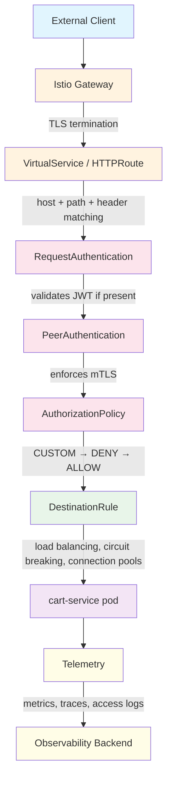
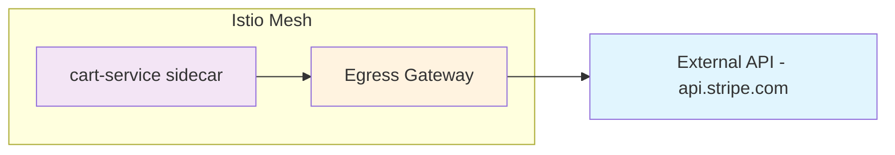
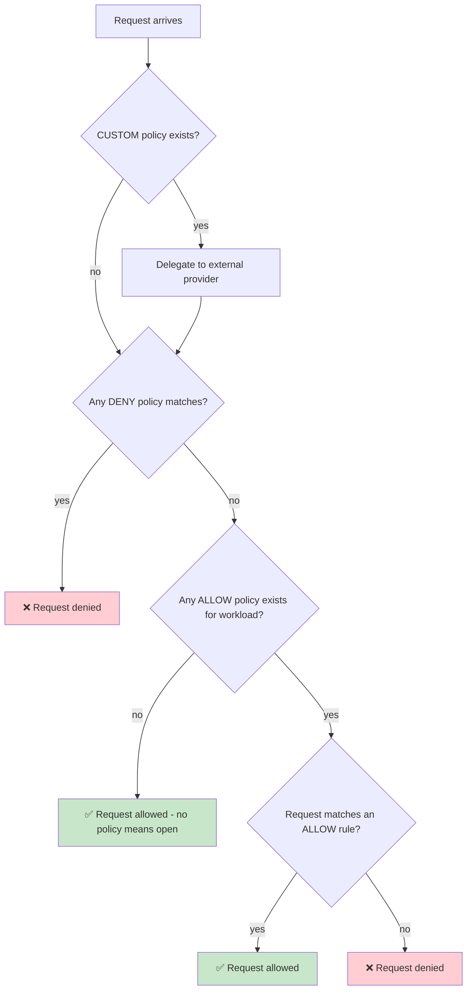

# Request Flow Diagram

This Mermaid diagram renders automatically on GitHub. It shows the path of a single request through the Istio mesh to cart-service.

## Egress flow (controlled outbound)

## Policy evaluation order

